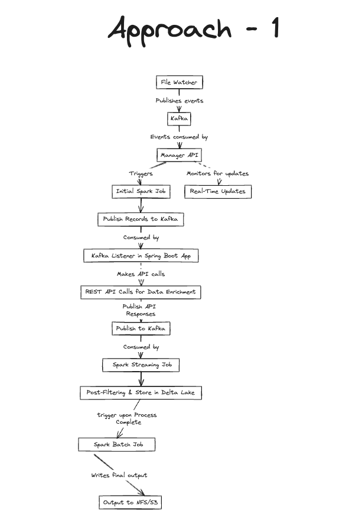
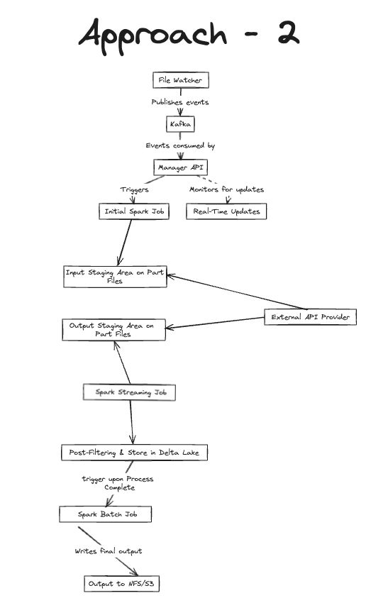

# File Processing Workflow README

## Approach 1: With External API Calls

1. **File Detection & Event Publication:** The File Watcher Service detects a new file in the monitored directory (NFS/S3) and publishes an event to a Kafka topic designed for initiation events, signaling the start of the processing workflow.
2. **Event Consumption by Manager API:** The Manager API (Spring Boot), listening on the initiation Kafka topic, consumes the file detection event, indicating that a new processing sequence should be started.
3. **Triggering of Initial Spark Job:** The Manager API (Spring Boot) triggers an initial Spark batch job, which is responsible for reading the detected file, performing initial validations, and splitting the file into individual records.
4. **Publishing Records to Kafka:** Once validated and split, the individual records are published by the initial Spark job to a Kafka topic, making them available for further processing steps.
5. **Consumption of Records by Kafka Listener:** A Spring Boot application with a Kafka listener, part of the Manager API ecosystem, consumes the records from the Kafka topic, preparing them for external API invocations.
6. **REST API Calls for Data Enrichment:** For each consumed record, the Spring Boot application makes REST API calls to external services for necessary data enrichment or risk assessment.
7. **Publishing API Responses to Kafka:** The enriched data or risk assessment results from the external API are published back to a different Kafka topic by the Spring Boot application, making them available for subsequent processing.
8. **Consumption of Enriched Records by Spark:** A subsequent Spark job listens to the Kafka topic containing the API responses, consuming the enriched records for further processing.
9. **Post-Filtering and Storage in Delta Lake:** The Spark job performs post-filtering on the enriched records, applying necessary business logic and transformations before storing the processed data in Delta Lake for interim staging.
10. **Final Output Writing to NFS/S3:** After all processing is complete, the Spark job compiles the final output from the data stored in Delta Lake and writes this output to a designated location on NFS/S3, making it accessible to clients.
11. **Real-Time Updates by Manager API:** Throughout the processing workflow, the Manager API (Spring Boot) monitors Kafka for status updates and milestones, providing an API endpoint for clients to request the latest processing status, ensuring real-time updates are available.

## Approach 2: No External API Calls

1. **File Detection & Event Publication:** The File Watcher Service detects a new file and publishes an event to a Kafka topic dedicated to initiating the data processing workflow.
2. **Event Consumption by Manager API:** The Manager API (Spring Boot) consumes the file detection event from the initiation Kafka topic, signaling the start of a new processing sequence.
3. **Triggering of Initial Spark Job:** Triggered by the Manager API, an initial Spark batch job is started to read, validate, and split the file into individual part files.
4. **Generation of Part Files for External API Consumption:** These part files are stored in a designated staging area (NFS/S3), making them available for the external API team to consume.
5. **File Processing by External API Team:** The external API team processes the part files for data enrichment or risk assessment and generates output files containing the enriched data.
6. **Writing Output Files to Staging Output Folder:** The processed output files are stored back in a specified staging output folder (NFS/S3) by the external API team.
7. **Streaming of Enriched Records by Spark:** A subsequent Spark job streams the enriched records from the staging output folder, continuing the processing workflow.
8. **Post-Filtering and Storage in Delta Lake:** The Spark job applies further processing, including post-filtering, to the enriched records before storing them in Delta Lake for interim staging.
9. **Final Output Writing to NFS/S3:** The final processed data is compiled by Spark and written to a designated output location on NFS/S3, making it accessible to clients.
10. **Real-Time Updates by Manager API:** Throughout this process, the Manager API (Spring Boot) monitors for status updates and milestones, offering real-time updates to clients through an API endpoint.
