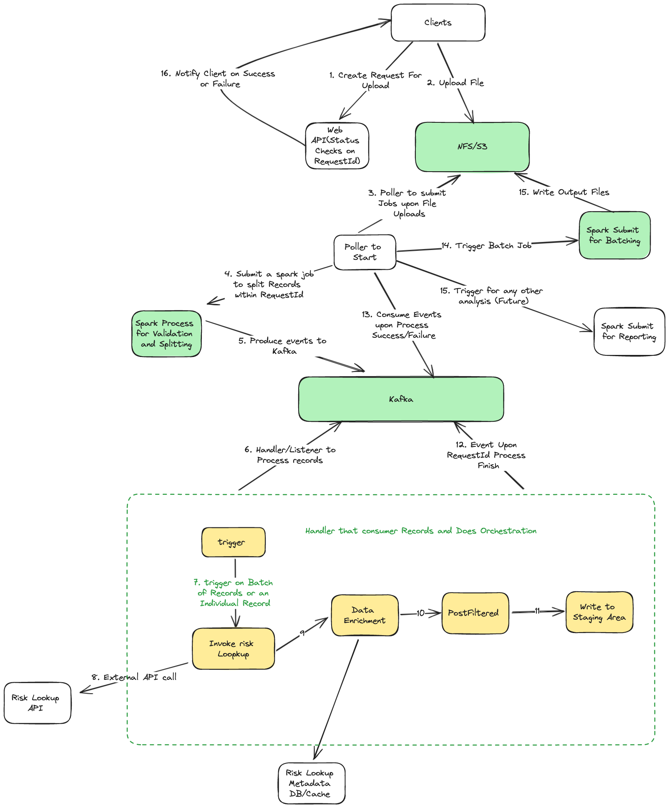

## Different Approaches
- [ ] Approach 1. End-to-End Processing System (Record By Record Processing)
  
- [ ] Approach 1. End-to-End Processing System (Batch Mode Processing)
  TODO

  
This README outlines the steps to set up and run an end-to-end processing system using Kafka, Temporal, and other tools. The system processes data as described in the provided end-to-end flow diagram (`e2e_image.png`).

## Prerequisites

Before proceeding, ensure you have the following installed:
- Docker
- Python 3.9+
- Maven 3.8+ (with support for 3.5+)
- Java 11 or 17
- Apache Spark (for submitting jobs)

## Setup

1. Clone the required repositories:
   ```bash
   git clone https://github.com/confluentinc/cp-all-in-one.git
   git clone https://github.com/temporalio/docker-compose.git
   ```

2. Navigate to the directory where the Kafka repository is cloned, move to `cp-all-in-one-community`, and start the services:
   ```bash
   cd cp-all-in-one/cp-all-in-one-community
   docker-compose up -d
   ```

3. Similarly, navigate to the directory containing the Temporal Docker Compose files and start the services:
   ```bash
   # Make sure to replace `<temporal_docker_directory>` with the actual directory path
   cd <temporal_docker_directory>
   docker-compose up -d
   ```

4. Install Python dependencies as declared in `requirements.txt` located within the `python-faker-data` directory:
   ```bash
   pip install -r requirements.txt
   ```

5. Set the environment variables with the folder path and the number of records for data generation as required.

6. Perform a Maven clean install package on the `RecordProcessorHandler` and `spark-split` directories:
   ```bash
   mvn clean install package
   ```

## Data Generation and Processing

1. Trigger the Python faker job to generate data:
   ```bash
   # Navigate to the directory containing the Python faker script and execute
   python <path_to_faker_script.py>
   ```

2. To split the data records, execute the following Spark command from the downloaded Spark bin directory:
   ```bash
   # Replace the paths with your actual paths
   /path/to/spark/bin/spark-submit --master "local[*]" --driver-memory 1g --executor-memory 2g --class com.example.ReadTextFileAndGenerateRecord /path/to/spark-split-1.0-SNAPSHOT-jar-with-dependencies.jar "local[*]" "/path/to/sample-data/txt/" "file_name.txt" "test-data"
   ```

3. Run the Java Spring Boot application (`RecordProcessorHandler`) for event consumption and orchestration:
   ```bash
   # From the IDE or using the command line
   java -jar /path/to/RecordProcessorHandler-0.0.1-SNAPSHOT.jar
   ```

4. After processing is complete, execute the Spark submit job for batching processed data:
   ```bash
   # Replace the paths with your actual paths
   /path/to/spark/bin/spark-submit --master "local[*]" --driver-memory 1g --executor-memory 2g --class com.example.MergeFiles /path/to/spark-split-1.0-SNAPSHOT-jar-with-dependencies.jar "local[*]" "/path/to/output-temp/" "/path/to/final-output" "request_id" 500
   ```

## Todo

- [ ] Configure end-to-end flow through Docker Compose to eliminate the need for local installations.
- [ ] Complete the entire sequence flow as shown as in the diagram.

Please refer to the end-to-end flow diagram for a visual understanding of the system process.
